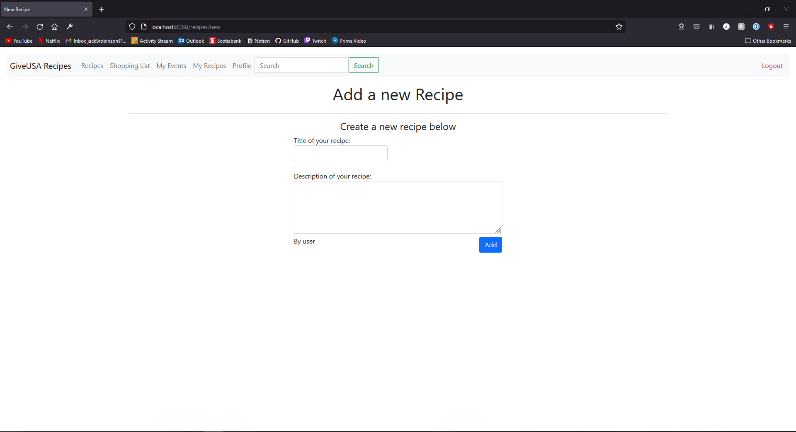
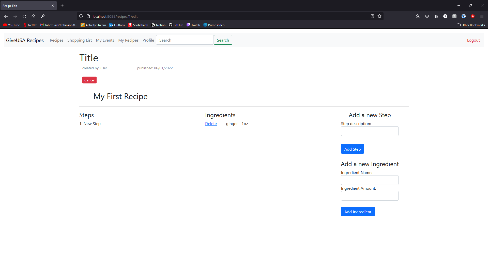
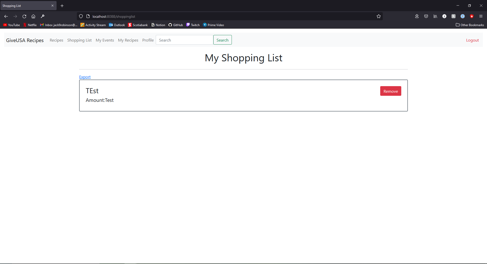
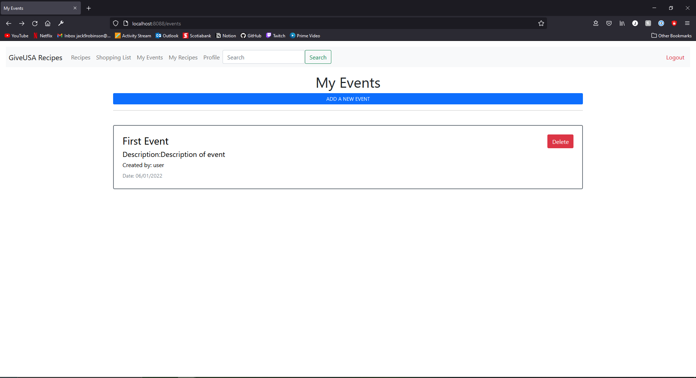
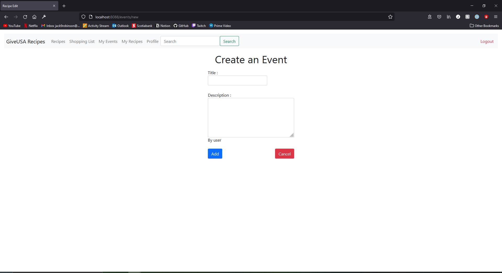
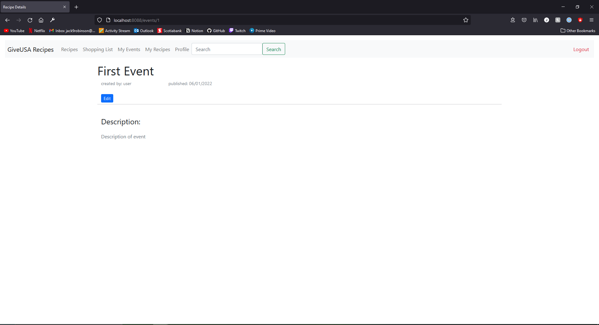
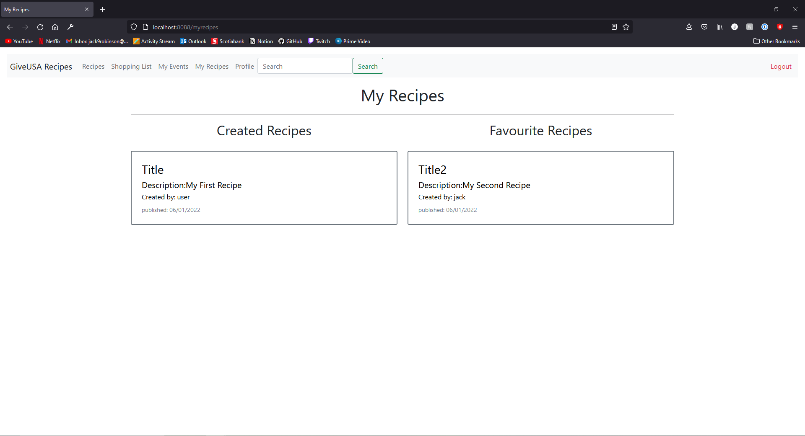
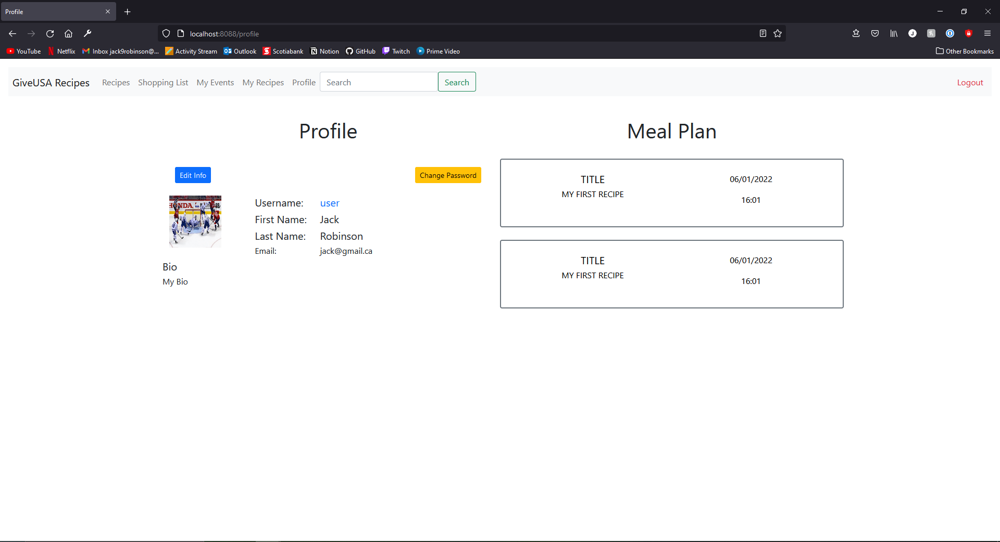
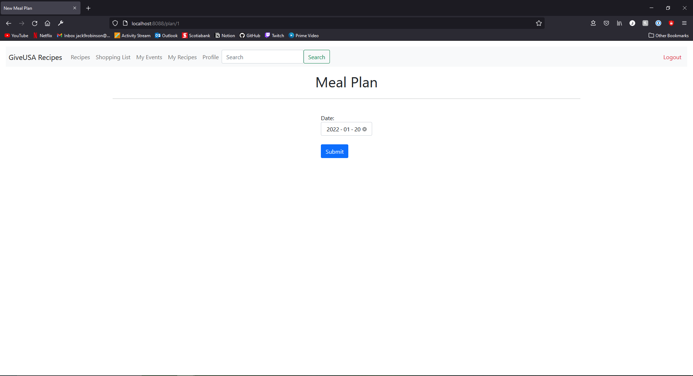

# comp3095_assignment
This is the assignmnet for Web Application Development Using Java COMP3095
The goal of this assignment was to create a recipe web application using Spring and H2

Features
- create a profile
- view all recipes
- view a specific recipe
- edit recipes user has create
- view, delete recipe steps and ingredients
- favourite a recipe
- add ingredient to user's shopping list
- export user's shopping list to a PDF
- view all events
- view a specific event
- edit and delete the user's events
- view create and favourited recipes
- view, edit user profile (first name, last name, email, bio, profile picture)
- change user password
- search for recipes using search bar

# Login Page

# View Recipes

# Create Recipe

# Edit Recipe

# View Shopping List

# View Events

# Create an Event

# View Event

# User Recipes

# User Profile

# Create Meal Plan

