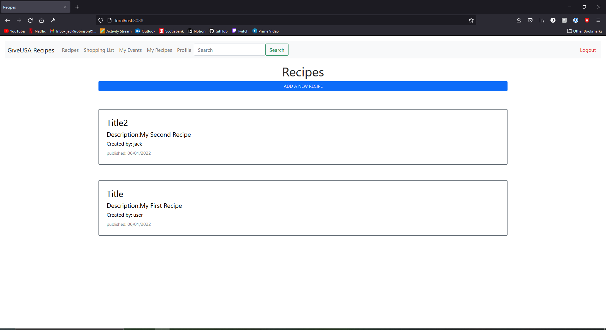

# comp3095_assignment
This is the assignmnet for Java Web Application Development COMP3095
The goal of this assignment was to create a recipe web application using Spring and H2

#Login Page

#View Recipes

